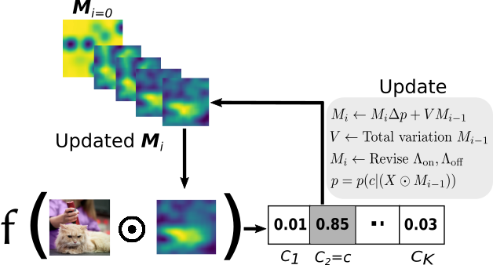
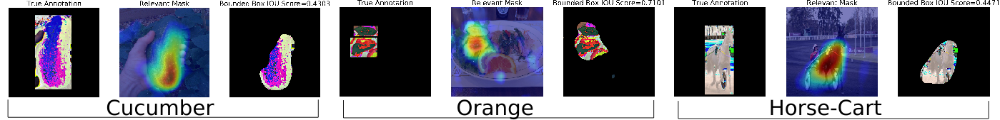
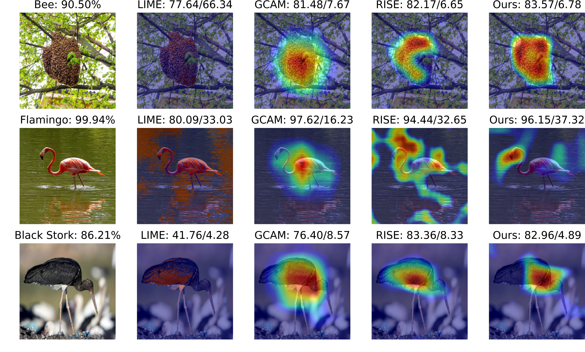

# Saliency-map based explanation
This repository contains source code necessary to reproduce some of the main results in the paper:

[Shailja Thakur](https://uwaterloo.ca/embedded-software-group/people-profiles/shailja-thakur), [Sebastian Fischmeister](https://uwaterloo.ca/embedded-software-group/people-profiles/sebastian-fischmeister) (ICPR, 2020)  
[A generalizable saliency map based model outcome explanation](https://arxiv.org/abs/2006.09504)

**If you use this software in an academic article, please consider citing:**

    
    @inproceedings{thakur2020generalizable,
      title={A generalizable saliency map-based interpretation of model outcome},
      author={Thakur, Shailja and Fischmeister, Sebastian},
      year={2020},
      booktitle={Proceedings of the International Conference on Pattern Recognition (ICPR)}
    }

## Problem
The inability of a deployed model to explain its decision-making process can cause the system to do more harm than good under unusual circumstances. 

## Method overview
We propose a non-intrusive explainability technique that generates a target-specific saliency map for a given input and the target prediction score. The approach relies on empirical risk minimization with a randomly initialized mask to locate the input pixels sensitive for the classification of the input to the target class. Thus, for a masked input, if the confidence of the model in the most probable class is given by p, then the optimal set of salient pixels for the input is empirically located by randomly retaining $p$\% of the unmasked pixels (with value >0) and (1-p)% of the masked pixels (with value zero) followed by weighing the pixels using the class score. Based on the evaluation of the approach on a wide range of datasets and state-of-the-art models, it was observed that the method converged faster to an estimate of the saliency-map and attained at least as good accuracy as the prior saliency-map-based approaches.

## Repository contents
* The whole idea is implemented in [explainer-prototype.ipynb](explainer-prototype.ipynb) notebook, it's done in Keras, and can be easily tweaked to work using other framework as it is model-agnotic in nature.
<!-- * [Saliency](Saliency.ipynb) notebook demonstrates the usage of RISE class optimized for PyTorch. -->
<!-- * [Evaluation](Evaluation.ipynb) notebook displays another contribution of the paper: *Causal metrics*. -->

# Examples 

### Pointing game evaluation

### Insert/Delete Metrics

